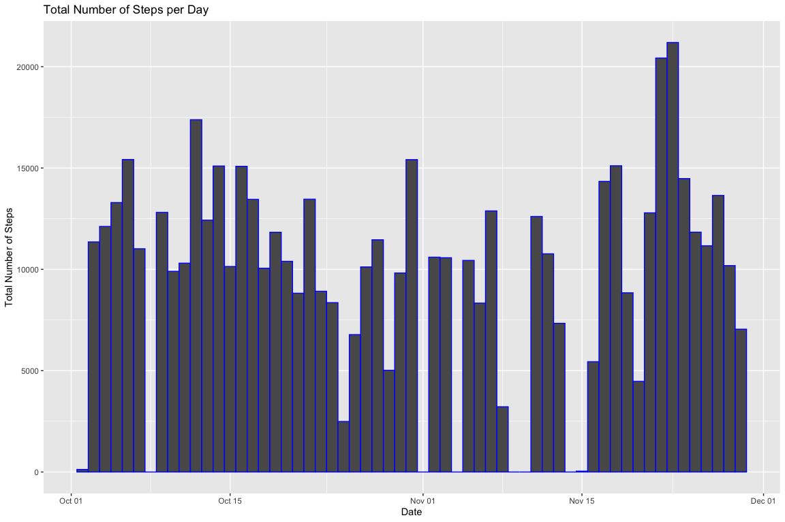
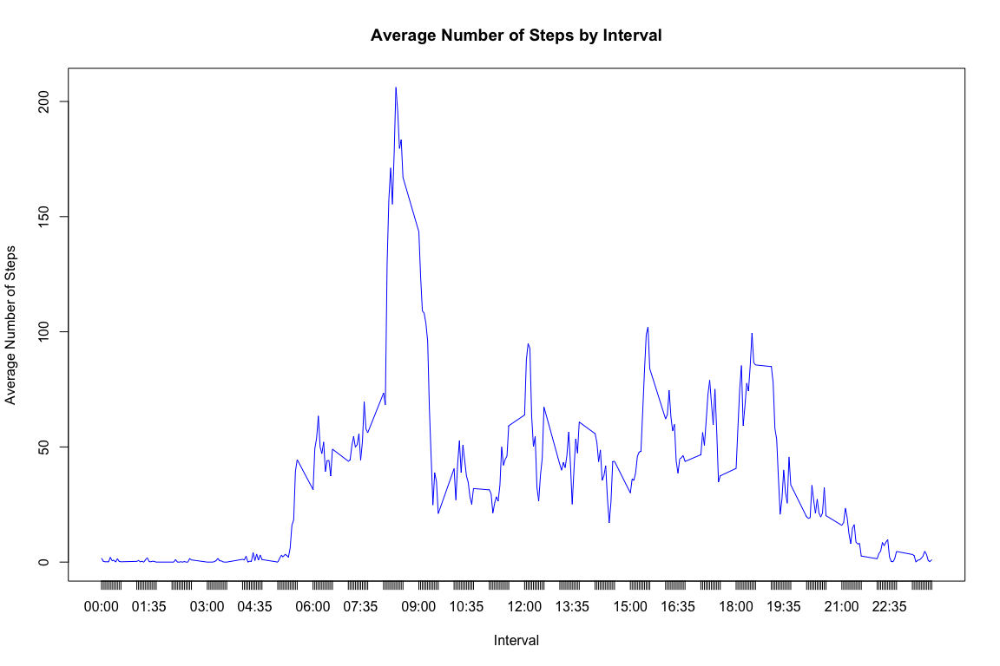
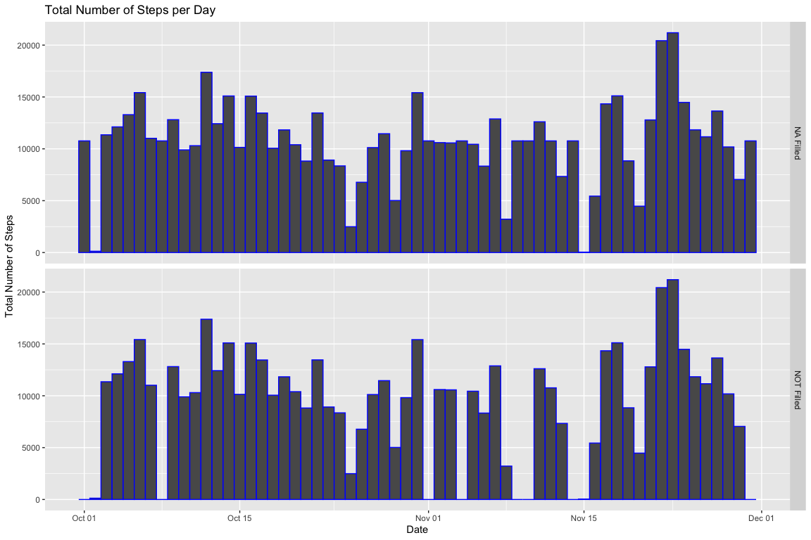
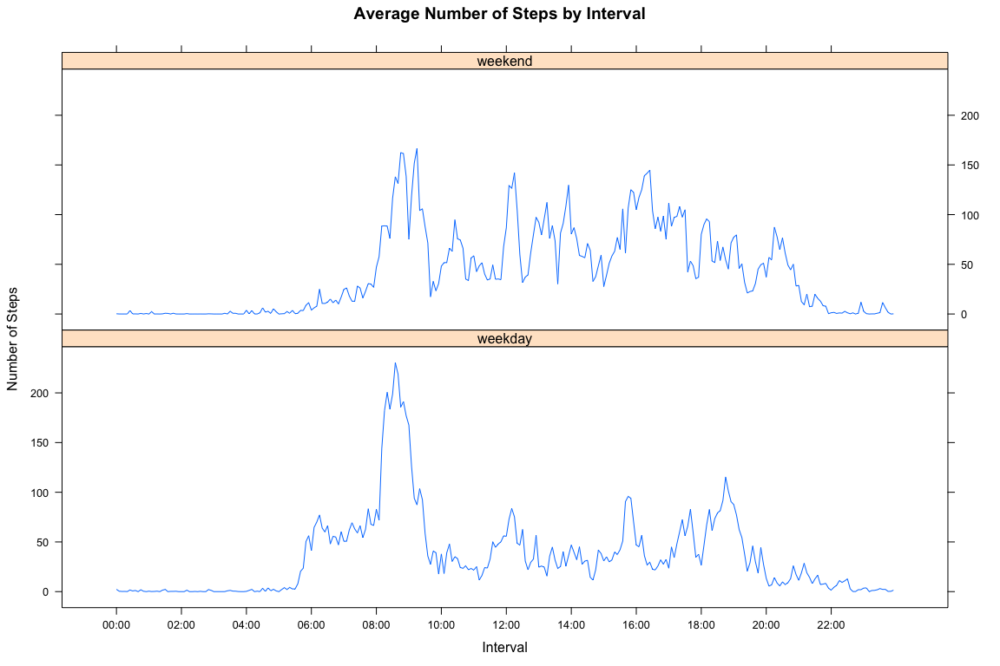

## Background

It is now possible to collect a large amount of data about personal movement using activity monitoring devices such as a [Fitbit](http://www.fitbit.com/), [Nike Fuelband](http://www.nike.com/us/en_us/c/nikeplus-fuelband), or [Jawbone Up](https://jawbone.com/up). These type of devices are part of the “quantified self” movement – a group of enthusiasts who take measurements about themselves regularly to improve their health, to find patterns in their behavior, or because they are tech geeks. But these data remain under-utilized both because the raw data are hard to obtain and there is a lack of statistical methods and software for processing and interpreting the data.

This assignment makes use of data from a personal activity monitoring device. This device collects data at 5 minute intervals through out the day. The data consists of two months of data from an anonymous individual collected during the months of October and November, 2012 and include the number of steps taken in 5 minute intervals each day.

The data for this assignment was downloaded from the course web site:

* Dataset: [Activity monitoring data](https://d396qusza40orc.cloudfront.net/repdata%2Fdata%2Factivity.zip) [52K]

The variables included in this dataset are:

* **steps**: Number of steps taking in a 5-minute interval (missing values are coded as <span style="color: red;">NA</span>
* **date**: The date on which the measurement was taken in YYYY-MM-DD format
* **interval**: Identifier for the 5-minute interval in which measurement was taken

The dataset is stored in a comma-separated-value (CSV) file and there are a total of 17,568 observations in this dataset.

## The Assignment

The assignment is about to analyse the data to answer a number of questions such as daily activity pattern, how that pattern differs between weekdays and weekends and etc. Furthermore, it raises the question on how to handle the <span style="color: red;">NA</span>s in the dataset and the impact of imputing missing data on the analysis. 

&nbsp;

#### Loading and preprocessing the data

###### 1. Load the data


```r
unzip("activity.zip")
act <- read.csv("activity.csv", header = TRUE, na.strings = "NA") 
```

###### 2. Change variable _date_ to _Date_ format for easy processing


```r
act <- act %>% mutate(date = as.Date(as.character(date), "%Y-%m-%d")) 
```
&nbsp;

#### What is mean total number of steps taken per day?

###### 1. Calculate the total number of steps taken per day.

There are 2 different ways we can handle the missing values here. The first is to use <span style="color: red;">_is.na()_</span> in the filter to exclude observations with missing values from the calculation all together. Another way is to only to exclude it from the summation by using <span style="color: red;">_na.rm = TRUE_</span> to the call of _sum()_, the obsercation is counted towards total number of observations. How we handle the exclusion here has a profound impact on imputing the missing values and furthermore on preservation of means and medians before and after imputing. 

Here is an example on how the 2 ways of exclusion differs. Say, for a given interval, the first day the number of steps is <span style="color: red;">NA</span>, the 2nd day is 3 and the 3rd day is 3. Using <span style="color: red;">_is.na()_</span> will have a mean of 3. With <span style="color: red;">_na.rm = TRUE_</span> to _sum()_ will yields a mean of 2. Later on when we imput this missing value with the mean, the new mean after imputing for the 1st approach remains 3, however the new mean for the 2nd approach will change to (2 + 3 + 3) / 3 = 2.67. 


```r
total_by_date <- act %>% filter(!is.na(steps)) %>% group_by(date) %>% summarise(total = sum(steps))
```

###### 2. Make a histogram of the total number of steps taken each day


```r
ggplot(total_by_date) + 
    geom_histogram(aes(x = date, weight=total), col ="blue", binwidth = 1) + 
    labs(x = "Date", y = "Total Number of Steps", title = "Total Number of Steps per Day") 
```

<!-- -->

###### 3. Calculate and report the mean and median of the total number of steps taken per day


```r
data.frame(Daily.Total.Mean = mean(total_by_date$total),
           Daily.Total.Median = median(total_by_date$total), 
           Daily.Total.Std = sd(total_by_date$total))
```

```
##   Daily.Total.Mean Daily.Total.Median Daily.Total.Std
## 1         10766.19              10765         4269.18
```
&nbsp;

#### What is the average daily activity pattern?

As you can see from the time series plot, the daily activity starts around 6:30am, peaks around 8:30am. From around 9:00am till about 6:00pm, it is medium level. From around 6:30pm till about 11:00pm, it winds down. Minumum amount of activity after that and through out the night.

###### 1. Make a time series plot (i.e. type = "l") of the 5-minute interval (x-axis) and the average number of steps taken, averaged across all days (y-axis)


```r
average_by_interval <- act %>% 
    filter(!is.na(steps)) %>%
    group_by(interval) %>% 
    summarise(average = mean(steps)) %>% 
    mutate(tick = paste(str_pad(interval %/% 100, 2, pad = "0"), str_pad(interval %% 100, 2, pad = "0"), sep = ":"))

with(average_by_interval, 
    plot(interval, average, type = "l", xaxt='n', col = "blue", pch = 20, xlab = "Interval", ylab = "Average Number of Steps", main = "Average Number of Steps by Interval", xlim = range(interval)))
axis(1, at=average_by_interval$interval, labels=average_by_interval$tick)
```

<!-- -->

###### 2. The 8:35am interval contains the maximum number of steps


```r
average_by_interval %>% filter(average == max(average))
```

```
## # A tibble: 1 x 3
##   interval average tick 
##      <int>   <dbl> <chr>
## 1      835    206. 08:35
```
&nbsp;

#### Imputing missing values

There are a number of days/intervals where there are missing values (coded as <span style="color: red;">NA</span>). The presence of missing days may introduce bias into some calculations or summaries of the data.

###### 1. The total number of missing values in the dataset (i.e. the total number of rows with <span style="color: red;">NA</span>s)


```r
sum(is.na(act$steps))
```

```
## [1] 2304
```

###### 2. Filling in all of the missing values in the dataset using the mean for that 5-minute interval.

###### 3. Create a new dataset that is equal to the original dataset but with the missing data filled in.


```r
filled <- merge(act, average_by_interval, by = "interval") %>% 
    filter(is.na(steps)) %>% mutate(steps = average) %>% 
    select(-average, -tick) %>% rbind(filter(act, !is.na(steps)))

summary(filled)
```

```
##     interval          steps             date           
##  Min.   :   0.0   Min.   :  0.00   Min.   :2012-10-01  
##  1st Qu.: 588.8   1st Qu.:  0.00   1st Qu.:2012-10-16  
##  Median :1177.5   Median :  0.00   Median :2012-10-31  
##  Mean   :1177.5   Mean   : 37.38   Mean   :2012-10-31  
##  3rd Qu.:1766.2   3rd Qu.: 27.00   3rd Qu.:2012-11-15  
##  Max.   :2355.0   Max.   :806.00   Max.   :2012-11-30
```

###### 4. Make a histogram of the total number of steps taken each day and Calculate and report the mean and median total number of steps taken per day. 


```r
total_by_date_filled <- filled %>% group_by(date) %>% summarise(total = sum(steps)) %>% mutate(filled = "NA Filled")
total_by_date_unfilled <- total_by_date %>% mutate(filled = "NOT Filled")

ggplot(rbind(total_by_date_filled, total_by_date_unfilled)) + 
    geom_histogram(aes(x = date, weight=total), col ="blue", binwidth = 1) +
    facet_grid(filled ~ .) +
    xlab("Date") + 
    ylab("Total Number of Steps") + 
    ggtitle("Total Number of Steps per Day") 
```

<!-- -->

Since we use the mean of the interval, the mean remains unchanged before and after the imputing. There is a slight change on the median. The change in standard deviation is more pronunced as the data is less **variant** after filling the missing value with the mean.


```r
filled_vs_unfilled <- data.frame(Daily.Total.Mean = c(mean(total_by_date_filled$total), mean(total_by_date$total)),
                                 Daily.Total.Median = c(median(total_by_date_filled$total), median(total_by_date$total)),
                                 Daily.Total.Std = c(sd(total_by_date_filled$total), sd(total_by_date$total)))
row.names(filled_vs_unfilled) <- c("NA Filled", "NOT Filled")

print(filled_vs_unfilled)
```

```
##            Daily.Total.Mean Daily.Total.Median Daily.Total.Std
## NA Filled          10766.19           10766.19        3974.391
## NOT Filled         10766.19           10765.00        4269.180
```
&nbsp;

#### Are there differences in activity patterns between weekdays and weekends?

There is a noticable difference in the acticity patterns. During weekdays, the activity picks up around 6:00am (getting up and getting ready to go to work). During weekends, the activity remains low until around 8:00am (sleeping in). 

###### 1. Create a new factor variable in the dataset, with the filled-in missing data, with two levels – “weekday” and “weekend” indicating whether a given date is a weekday or weekend day. For the remaining of the day, in general, weekend activity level is highher then that of the weekdays (up and about doing things). 


```r
wdays <- factor(weekdays(filled$date) %in% c("Saturday", "Sunday"), labels = c("weekday", "weekend"))
filled <- filled %>% select(-date) %>% mutate(weekday = wdays)
head(filled)
```

```
##   interval    steps weekday
## 1        0 1.716981 weekday
## 2        0 1.716981 weekend
## 3        0 1.716981 weekday
## 4        0 1.716981 weekday
## 5        0 1.716981 weekday
## 6        0 1.716981 weekday
```

###### 2. Make a panel plot containing a time series plot (i.e. type = "l") of the 5-minute interval (x-axis) and the average number of steps taken, averaged across all weekday days or weekend days (y-axis). See the README file in the GitHub repository to see an example of what this plot should look like using simulated data.


```r
filled <- filled %>% 
    group_by(weekday, interval) %>% 
    summarise(average = mean(steps)) %>%
    mutate(interval = as.POSIXct(
        paste("1970-01-01", 
              paste(str_pad(interval %/% 100, 2, pad = "0"), 
                    str_pad(interval %% 100, 2, pad = "0"), 
                    sep = ":"), 
              sep = " ")))

xyplot(average ~ interval | weekday, 
       type = "l", 
       data = filled, 
       layout = c(1, 2), 
       xlab = "Interval", ylab = "Number of Steps", main = "Average Number of Steps by Interval",
       scales = list(x = list(at = seq(as.POSIXct(filled$interval[1]), by="2 hour", length=12), 
                              labels=format(seq(as.POSIXct(filled$interval[1]), by="2 hour", length=12),
                                            "%H:%M"))))
```

<!-- -->
